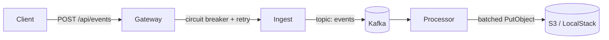

# springboot-event-platform

An event-driven asset-tracking platform built to demonstrate production-grade
Java 21 / Spring Boot 4.0 patterns: an API gateway with circuit breakers and
retries, customer-facing REST ingest, Kafka-backed processing on virtual threads,
and AWS S3 archival. Runs locally end-to-end with one `docker compose up`.

## Why this exists

After 26+ years building distributed backends — Nortel telecom, defense systems
at Securboration, AWS-native services at Rampart-AI — I wanted a single public
codebase to point at when conversations turn to "show me the stack." This is
that repo. The domain (asset/position events) is deliberately generic so the
same patterns map cleanly to freight rail movements, financial transactions,
or medical-device telemetry.

## Architecture



Three Spring Boot 3.3 services on Java 21, connected by Apache Kafka, deployable
locally via Docker Compose. See [docs/architecture.md](docs/architecture.md)
for the full diagram and failure-mode discussion.

## Skills demonstrated

Every must-have on a typical mid-senior Java backend JD, with file paths so you
can jump straight to the proof:

| Skill | Where it lives |
|---|---|
| **Java 21** (records, virtual threads, pattern-matching) | [`ProcessorApplication.java`](event-processor/src/main/java/com/dskow/eventplatform/processor/ProcessorApplication.java), all `Event.java` records |
| **Spring Boot 4.0** customer-facing REST API | [`EventController.java`](event-ingest/src/main/java/com/dskow/eventplatform/ingest/api/EventController.java) |
| **Jackson 3** native serdes via `JacksonJsonSerializer` / `JacksonJsonDeserializer` | [`event-ingest/application.yml`](event-ingest/src/main/resources/application.yml), [`event-processor/application.yml`](event-processor/src/main/resources/application.yml) |
| **Spring Cloud Gateway** | [`event-gateway/application.yml`](event-gateway/src/main/resources/application.yml) — route definitions, predicates, filters |
| **Resilience4j circuit breaker + retry** | [`event-gateway/application.yml`](event-gateway/src/main/resources/application.yml) (config), [`FallbackController.java`](event-gateway/src/main/java/com/dskow/eventplatform/gateway/FallbackController.java) (fallback) |
| **Apache Kafka** producer + consumer | [`EventProducer.java`](event-ingest/src/main/java/com/dskow/eventplatform/ingest/kafka/EventProducer.java), [`EventConsumer.java`](event-processor/src/main/java/com/dskow/eventplatform/processor/kafka/EventConsumer.java) |
| **Multi-threading** via virtual threads + `@Async` | [`ProcessorApplication.java`](event-processor/src/main/java/com/dskow/eventplatform/processor/ProcessorApplication.java) executor bean, [`EventConsumer.java`](event-processor/src/main/java/com/dskow/eventplatform/processor/kafka/EventConsumer.java) listener |
| **AWS S3** via SDK v2 | [`S3Config.java`](event-processor/src/main/java/com/dskow/eventplatform/processor/config/S3Config.java), [`S3Archiver.java`](event-processor/src/main/java/com/dskow/eventplatform/processor/s3/S3Archiver.java) |
| **Docker** multi-stage builds, non-root user | [`event-gateway/Dockerfile`](event-gateway/Dockerfile) and the two siblings |
| **Bean validation + global error mapping** | `@Valid` on `EventController`, request rejected with 400 for missing `assetId` |
| **Observability** | Spring Actuator + Micrometer Prometheus on every service (`/actuator/prometheus`) |
| **Tests** with Spring `@WebMvcTest` and pure-unit batching | [`EventControllerTest.java`](event-ingest/src/test/java/com/dskow/eventplatform/ingest/EventControllerTest.java), [`ProcessorApplicationTests.java`](event-processor/src/test/java/com/dskow/eventplatform/processor/ProcessorApplicationTests.java) |
| **CI** GitHub Actions: Maven build + Docker image build | [`.github/workflows/ci.yml`](.github/workflows/ci.yml) |

## Quick start

Prerequisites: Docker Desktop and ~4 GB free RAM. (Optional for native build:
JDK 21 and Maven 3.9+.)

```bash
git clone https://github.com/<your-handle>/springboot-event-platform
cd springboot-event-platform
docker compose up --build
```

Wait for `kafka` to report healthy (~20 s on first run). Then in another shell:

**bash / zsh:**
```bash
curl -X POST http://localhost:8080/api/events \
  -H 'Content-Type: application/json' \
  -d '{"assetId":"asset-42","latitude":35.7,"longitude":-78.6,"status":"in-transit"}'
```

**Windows PowerShell** — easiest is the native cmdlet, which sidesteps the quote-passing-to-native-exe quirk:
```powershell
Invoke-RestMethod -Uri http://localhost:8080/api/events -Method Post `
  -ContentType 'application/json' `
  -Body '{"assetId":"asset-42","latitude":35.7,"longitude":-78.6,"status":"in-transit"}'
```

If you prefer real curl, use `curl.exe` (to bypass the `Invoke-WebRequest` alias) and backslash-escape the inner double quotes — PowerShell strips them otherwise:
```powershell
curl.exe -X POST http://localhost:8080/api/events `
  -H "Content-Type: application/json" `
  -d '{\"assetId\":\"asset-42\",\"latitude\":35.7,\"longitude\":-78.6,\"status\":\"in-transit\"}'
```

Inspect the S3 archive (LocalStack):
```bash
docker exec sep-localstack awslocal s3 ls s3://event-archive/events/
```

## Demonstrating the circuit breaker

Stop `event-ingest` while the gateway is still running:

```bash
docker compose stop event-ingest
# fire a few requests through the gateway
for i in {1..6}; do
  curl -s -o /dev/null -w "%{http_code}\n" -X POST http://localhost:8080/api/events \
    -H 'Content-Type: application/json' \
    -d '{"assetId":"asset-42","latitude":0,"longitude":0,"status":"x"}'
done
# after the failure threshold, the circuit opens and you get 503 from /fallback/events
curl http://localhost:8080/actuator/circuitbreakers
```

Bring `event-ingest` back with `docker compose start event-ingest` — the circuit
transitions through HALF_OPEN and back to CLOSED automatically.

## Build native (without Docker)

```bash
mvn -B verify
java -jar event-ingest/target/event-ingest-0.1.0-SNAPSHOT.jar
```

Each service expects a Kafka broker; either run the `kafka` and `localstack`
containers from `docker-compose.yml` only (`docker compose up kafka localstack`)
or override `KAFKA_BOOTSTRAP_SERVERS` to point at your own.

## Repo layout

```
.
├── docker-compose.yml         # full local stack
├── pom.xml                    # parent: Spring Boot 3.3, Java 21, deps mgmt
├── event-gateway/             # Spring Cloud Gateway + Resilience4j
├── event-ingest/              # REST API → Kafka producer
├── event-processor/           # Kafka consumer → S3 batch archiver
├── docs/architecture.md       # diagrams + failure-mode discussion
└── .github/workflows/ci.yml   # Maven build + Docker image build
```

## Roadmap

The current code is intentionally minimal but real. Near-term additions:

- Terraform module deploying to ECS Fargate behind an ALB with a real S3 bucket
- `k6` load script demonstrating the circuit breaker tripping under fault injection
- Dead-letter topic for failed S3 archival batches
- Integration tests using Testcontainers for Kafka + LocalStack S3 together
- A small TypeScript dashboard reading the gateway's metrics endpoint

## Author

David Skowronski · david@dskow.com · [linkedin.com/in/david-skowronski-9035753](https://www.linkedin.com/in/david-skowronski-9035753)
