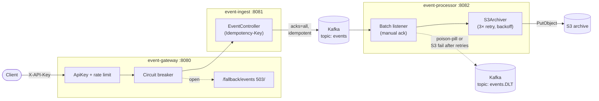

# Architecture

## Component diagram

## Request flow

1. Client posts to `POST http://localhost:8080/api/events` with an
   `X-API-Key` header (and optionally an `Idempotency-Key`).
2. **event-gateway** authenticates the API key, applies the in-memory
   rate limit, then routes through the Resilience4j `CircuitBreaker`.
   When the breaker is open, requests are forwarded to `/fallback/events`
   (503 response).
3. **event-ingest** validates the payload, resolves the event id (body
   field → `Idempotency-Key` header → fresh UUID), stamps `timestamp` if
   absent, and publishes to Kafka topic `events` with `acks=all` and an
   idempotent producer.
4. **event-processor** consumes batches via Spring-Kafka's batch listener
   (`max-poll-records=100`), archives the batch to S3 inline with retry +
   exponential backoff, and only then **manually acks** the offsets.
   Crashes between poll and ack cause Kafka to redeliver; persistent S3
   failures (after the retry budget) propagate to the `DefaultErrorHandler`,
   which republishes each record to `events.DLT`.

## Failure modes the design addresses

| Failure | Mitigation |
|---|---|
| Forged or anonymous client traffic | Gateway rejects 401 unless `X-API-Key` matches the configured allowlist; per-key in-memory token bucket caps to ~10 req/s burst 20 |
| Gateway upstream (event-ingest) down or slow | Resilience4j circuit breaker opens after 50% failure rate over a 10-call window; clients receive 503 from `/fallback/events` until the breaker half-opens |
| Gateway retry duplicating POSTs | Retry filter no longer covers POST. Clients that need safe retry send `Idempotency-Key`; ingest uses the header value as the event id so downstream sees the same record on every retry |
| Kafka briefly unavailable | Producer retries internally with idempotence; consumer resumes from the last committed offset on reconnect |
| S3 transient failure | `S3Archiver` retries 3× with exponential backoff (100 ms → 2 s); offsets stay un-acked during retries so a JVM crash doesn't lose the batch |
| S3 persistent failure | After the retry budget the listener throws; Spring-Kafka's `DefaultErrorHandler` retries the batch (3 attempts, exp backoff 1–10 s) and then routes each record to `events.DLT` so the partition can advance |
| Poison-pill record (deserialization failure) | `ErrorHandlingDeserializer` wraps `JacksonJsonDeserializer`; the failure surfaces as an exception that `DefaultErrorHandler` routes straight to `events.DLT` without blocking the partition |
| OOM under back-pressure | Kafka's poll-based batching is the only buffer — there is no in-memory queue to grow without bound. Slow S3 simply stalls the next poll, applying back-pressure at the broker |

## Tunable knobs

| Property | Default | Purpose |
|---|---|---|
| `app.archive-bucket` | `event-archive` | S3 bucket name |
| `app.dlt-topic` | `events.DLT` | Dead-letter topic for poison pills and post-retry failures |
| `app.archive-max-attempts` | 3 | S3 PutObject attempts inside `S3Archiver` |
| `app.archive-initial-backoff-ms` | 100 | First retry delay |
| `app.archive-max-backoff-ms` | 2000 | Cap on the exponential backoff |
| `spring.kafka.consumer.max-poll-records` | 100 | Records per S3 archive batch |
| `app.security.api-keys` | _(empty)_ | Comma-separated `X-API-Key` allowlist; empty = open mode for local dev |
| `app.security.rate-limit-rps` | 10 | Token-bucket refill rate per key |
| `app.security.rate-limit-burst` | 20 | Token-bucket capacity per key |
| `resilience4j.circuitbreaker.instances.ingestCB.failureRateThreshold` | 50 | % failures before the circuit opens |
| `resilience4j.circuitbreaker.instances.ingestCB.waitDurationInOpenState` | 10s | How long the circuit stays open |
| `management.tracing.sampling.probability` | 1.0 | Fraction of requests carrying a sampled traceId end-to-end |
